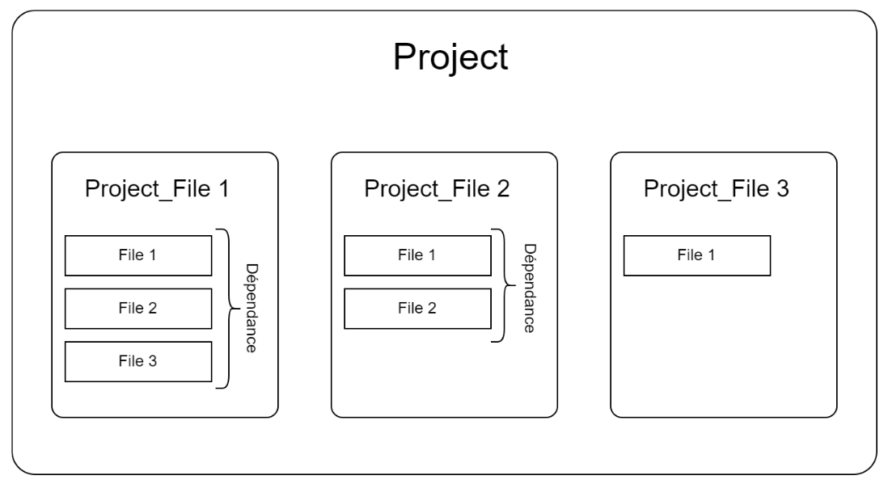

# Models

The files are handled by the App like files in a folder, the folder being the [`ProjectFile`](#projectfile) instance and the files in the folder are the files uploaded by the user saved as [`FileChunk`](#filechunk) instances. The `FileChunk` instance having a foreign key to the `ProjectFile` instance.





# ProjectFile

Class which instances represents the files uploaded by the `AG_DATA` users and that are meant to be seen and downloaded by `CLIENT` users, as well as visualized on the platform.

```python
class ProjectFile(models.Model):
    name = models.CharField(max_length=50, unique=True)
    description = models.CharField(max_length=500)
    file_type = models.ForeignKey(FileType, on_delete=models.CASCADE, null=True)
    file_extention =  models.ForeignKey(FileExtention, on_delete=models.CASCADE, null=True)
    data_type = models.ForeignKey(DataType, on_delete=models.CASCADE, null=True)
    date = models.DateField(auto_now=True)
    project = models.ForeignKey(Projects, on_delete=models.CASCADE, null=True, related_name="to_project")
    processed = models.BooleanField(default=False)
    error = models.BooleanField(default=False)
    error_message = models.CharField(max_length=500)
    def __str__(self):
        return self.name

    @property
    def allowed(self):
        return (self.project.user,)
```
- `file_type` : foreign key to [`FileType`](#filetype) instance representing the file type (visualization mode)
- `data_type` : foreign key to [`DataType`](#dattype) instance representing to what table the data should be extracted.
- `project`: foreign key to [`Project`](/docs/Apps/user/Models.md#project) instance representing to what project the file is linked

## CallBacks
### post_delete_file()

This callback delete the related files from the Storage System thus freeing space by removing unused files.
### post_save_Project_File()
This callback create a [`LayerOrder`](#layerorder) instance for the file if it is a `GEO_FILE` instance (`GEO_FILE` is a `FileType` instance). It gives priority, putting them on top level, to files that has a `data_type` linked to them, thus files who are not `rasters`.


# LayerOrder

These instances represents the layers dispositions on the map, `GEO_FILE` with higher order number are displayed over `GEO_FILE` with lower ones.

```python
class LayerOrder(models.Model):
    project_file = models.OneToOneField(ProjectFile, on_delete=models.CASCADE, primary_key=True)
    order = models.IntegerField(default=1)
```
# FileType

Each `ProjectType` instance has a `FileType` attribute that represent how the file should be visualized for example `GEO_FILE` will be visualized on maps, `ANALYTICS` in tables, `IMAGES` on pup ups etc..
You can check the Class Structure using this link : [Link For Class Structure](...)

```python
class FileType(models.Model):
    label = models.CharField(max_length=50, unique=True)
    description = models.CharField(max_length=500)

    def __str__(self):
        return self.label
```
# DataType

Each `ProjectType` instance has a `DataType` attribute that represents how the file should be processed and where its data should be stored. In other words, it represents in what table the parsed data from the file will be stored, and what function will be used to parse de data
You can check the Class Structure using this link : [Link For Class Structure](...)

```python
class DataType(models.Model):
    label = models.CharField(max_length=50, unique=True)
    description = models.CharField(max_length=500)
    object_type = models.ForeignKey(ContentType, on_delete=models.SET_NULL, null=True)
    fields = ArrayField(models.CharField(max_length=255), null=True)
```
- `fields` : contains an array of all the fields label of the `DataType`, this array is automatically generated upon creation.
- `object_type` : is a foreign key to the `ContentType` table that collects all the tables created by django. Therefore, it is a foreign key to a `ContentType` instance, thus, a table. 


## Call backs
### post_delete_data()
This callback function is called when a `DataType` instance is deleted, its purpose is to delete the related [`CustomDataType`](#customdatatype) instance, thus deleting the `DataType` related table.

# FileExtention
Class which instances represent what extension the file is using. Those extensions are used only by the app and are not necessary the standards extensions used by the different file systems.

```python
class FileExtention(models.Model):
    extention = models.CharField(max_length=20, unique=True)
    file_type = models.ForeignKey(FileType, on_delete=models.CASCADE, blank=False)

    def __str__(self):
        return self.extention
```

# FileChunk

Class which instances represents individual files that constitute the `ProjectFile`. Those files are received by chunks and then regrouped to form a complete file who is then processed.

```python

class FileChunk(models.Model):
    
    to_project_files = models.ForeignKey(ProjectFile, on_delete=models.CASCADE, null=True, related_name='files')
    
    file = models.URLField(null=True, max_length=1200)
    file_name = models.CharField(max_length=500)
    nbr_chunk= models.IntegerField()
    cumulated_chunk = models.IntegerField()
    @property
    def allowed(self):
        return (self.to_project_files.project.user,)
```
- `to_project_files` : foreign key to the `ProjectFile` instance this file is related to.
- `nbr_chunk` : number of chunks expected to be received in the upload phase
- `cumulated_chunk` : number of chunks received and saved

# FileDataType

Class which instances represents the files that are received in order to create a new `DataType`.

```python

class FileDataType(models.Model):
    to_data= models.ForeignKey(DataType, on_delete=models.CASCADE,null=True, related_name='files')
    file = models.FileField(upload_to=get_upload_to_data, 
                            #storage=StorageManager()  # here we use the storage manager to rename the files if they exist
                            )
```

## Callbacks
### get_upload_to_data()
function that returns the file path in which the file will be saved.

# CustomDataType

This class stores the necessary data that will be used to create a model from a `DataType`, and the the corresponding table after migrating the model.

```python
class CustomDataType(models.Model):
    table_name = models.CharField(max_length=255)
    fields = models.JSONField()
    mapping = models.JSONField()
    params = models.JSONField()
```

- `fields` : fields of the `DataType`. They are stored in the following format
```json
{
  //"field name": "field type",
  "nbr": "IntegerField",
  "name": "CharField",
}
```
- `mapping` : a json object that maps the table column to the corresponding field in the file used to extract the `DataType` fields

```json
{
//"field name in table" : "field name in file",
  "com": "COM",
  "f_id": "id",
  "geom": "POLYGON",
  "pv_module": "PV MODULE",
  "criticalit": "CRITICALIT"
}
```

- `params` : the django model parameters to include to the generated model fields on creation

# RasterData

class that represents the data extracted from the `raster` files

```python
class RasterData(models.Model):
    project_file = models.ForeignKey(ProjectFile, on_delete=models.CASCADE, null=True)
    raster = models.ForeignKey("raster.RasterLayer", on_delete=models.CASCADE, null=True)
    lon = models.FloatField()
    lat = models.FloatField()

    @property
    def allowed(self):
        return (self.project_file.project.user,)
```
- `raster` : foreign key to the [`RasterLayer`](/Apps/raster/MODELS#rasterlayer) instance related to the `project_file`

# ProjectField

This class instances represent the area that contains the project on the map. It is extracted from the `kml` file uploaded on project creation.

```python
class ProjectField(models.Model):
    project = models.ForeignKey(Projects, on_delete=models.CASCADE, related_name='delimitation_field')
    geom = models.MultiPolygonField(srid=4326, dim=3)
   
    @property
    def allowed(self):
        if self.project:
            return (self.project_set.user,)
        return (None,)
```

- `geom` : A geometry field (based on GIS library) that contains the data extracted from the `kml` file.